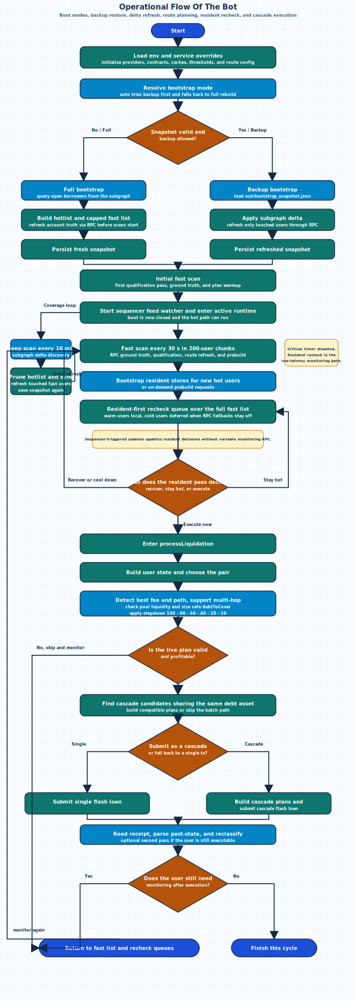
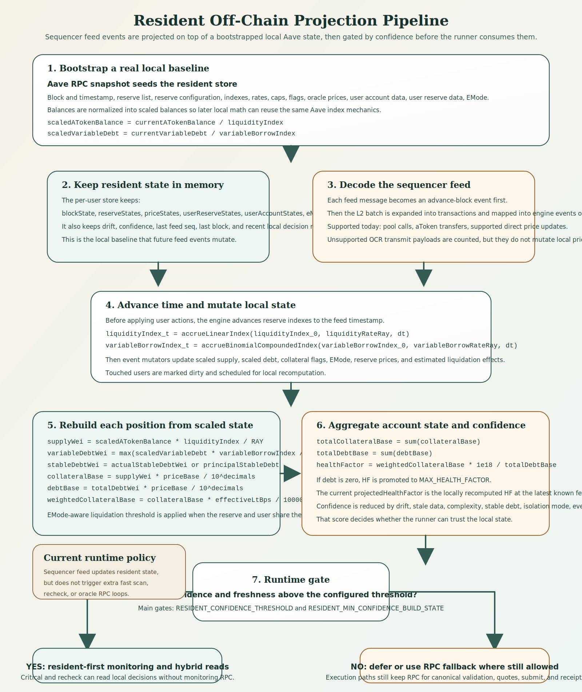

# Liquidator Stack

This repository is published in GitHub as `liquidator-stack-v2`, originally initialized with the short description "ultima versao".

This README is intentionally organized in English first and Portuguese below.
The diagrams use English labels because they describe the live runtime pipeline shared by both sections.

## English

### Overview

This repository contains the main liquidation runner, the resident off-chain engine, the contracts, and the operational scripts used to monitor Aave v3 positions on Arbitrum and execute liquidations when the execution path is favorable.

### Best State Reference

The best systematic reference for the repository state is the ATT timeline under `att/2026`.

Those files are the closest thing to a canonical engineering log because they are kept in planning-and-implementation order and usually record:

1. the problem or objective of the round;
2. the intended architectural direction;
3. what was actually implemented;
4. what was validated, deferred, or left conditional.

Recommended reading order depends on the question:

1. if you want the current state quickly, start from the highest-number ATT and move backwards until the subsystem you care about becomes clear;
2. if you want the full evolution of a subsystem, read the ATT sequence forward in numerical order;
3. use the root `RELATORIO_*.md` files as consolidations and summaries, not as the only source of sequencing.

In practice:

1. `README.md` gives the overview;
2. `att/2026` gives the chronological planning and implementation trail;
3. `RELATORIO_*.md` gives consolidated snapshots;
4. the code remains the final execution truth.

Current runtime policy:

1. startup now has an isolated `bootstrap` phase that must finish before any scan loop starts;
2. `BOOTSTRAP_MODE` resolves `full`, `backup`, or `auto`, with `auto` trying snapshot restore first and falling back to a full rebuild when needed;
3. `full` bootstrap uses subgraph open-borrower discovery plus direct RPC account reads to build the hotlist and the capped fast list, then persists `out/bootstrap_snapshot.json`;
4. `backup` bootstrap restores `out/bootstrap_snapshot.json`, applies only the subgraph delta since `lastHotlistSubgraphTs`, refreshes only touched users through RPC, and saves the refreshed snapshot again;
5. recurring deep scan stays subgraph-driven every 10 minutes, prunes coverage, and refreshes only delta-touched users through RPC;
6. fast scan runs every 30 seconds in 200-user chunks and is now the RPC ground-truth, qualification, route-refresh, and prebuild lane;
7. users entering the tracked hot path are bootstrapped into the resident engine, and the sequencer feed then advances local state and shadow tracking;
8. the periodic `criticalScan(...)` timer is disabled in the current service runtime; the resident `recheckScan(...)` queue now traverses the full fast list on sequencer-triggered cadence, processing warm resident users locally and deferring cold users instead of opening variable monitoring RPC when fallbacks stay off;
9. users may remain in the fast list even after resident bootstrap, so the fast lane keeps serving as the periodic truth-refresh and route-refresh path;
10. `prebuild` and `processLiquidation(...)` still use RPC where chain truth is required for quotes, fee/path detection, liquidity checks, plan validation, transaction submission, and receipts;
11. execution can escalate to cascade liquidation: multiple users sharing the same debt asset may be bundled into a single flash-loan transaction, otherwise the runner falls back to the single-user path.

### Runtime Model

| Layer | Primary source | Main purpose | Recurring RPC in current runtime |
| --- | --- | --- | --- |
| Coverage bootstrap | subgraph + snapshot + RPC | build hotlist and fast list before `active` | yes |
| Coverage and plan refresh | subgraph delta + periodic RPC | keep hotlist, fast list, snapshot, and route hints current | yes |
| Resident hot path | sequencer feed + resident store | resident-first recheck across the full fast list | no for monitoring |
| Execution path | RPC + on-chain execution | route refresh, stepdown sizing, cascade or single submit, receipt | yes |

The bot no longer relies on a single universal source of truth.
It runs as a hybrid system:

1. broad coverage and discovery through hotlist maintenance;
2. recurring refresh through fast scan;
3. hot monitoring of near-risk users through a resident local model;
4. execution through the on-chain path when the opportunity survives validation.

### Operational Timeline

| Stage | Trigger | Main I/O | Processing | RPC in current runtime | Output |
| --- | --- | --- | --- | --- | --- |
| Startup / infra | process start | `.env`, `ops/liquidator-bot-runtime.env`, caches, contracts | initialize providers, pairs, thresholds, route config, and local state | yes | infra ready |
| Bootstrap mode resolution | after infra | `BOOTSTRAP_MODE`, snapshot metadata | choose `full`, `backup`, or `auto -> backup/full` | no | boot path selected |
| Full bootstrap | selected full path | subgraph open borrowers + RPC account reads | build hotlist, cap and rebuild fast list, save snapshot | yes | fresh coverage ready |
| Backup bootstrap | selected backup path | `out/bootstrap_snapshot.json` + subgraph delta + touched-user RPC | restore coverage, apply delta, refresh touched users, save snapshot | yes, bounded to delta | warm restart coverage ready |
| Initial fast scan | after bootstrap | fast list + RPC snapshots | first qualification pass, plan warmup, and transition to `active` | yes | runtime enters active mode |
| Sequencer feed activation | after initial fast scan | local relay payload | start resident event ingestion and shadow tracking | no | hot path active |
| Deep scan / hotlist delta | 10 min timer | subgraph delta + touched-user RPC refresh | prune hotlist, sync fast users, refresh only affected users, persist snapshot | yes, bounded to delta | coverage stays current |
| Fast scan / plan refresh | 30 s timer | fast list + RPC snapshots + quoter | ground-truth users, qualify risk, refresh routes, prebuild plans | yes | updated plans and candidate states |
| Resident bootstrap | fast/recheck admission or prebuild request | Aave account, reserve, and oracle reads | create or refresh per-user resident store | bootstrap only | user becomes resident-trackable |
| Resident recheck pass | sequencer-triggered queue | full fast list + resident store + legacy `recheckUsers` map | resident-first whole-fast-list monitoring, process warm users locally, defer cold users, promote to exec when justified | no for monitoring |
| Prebuild / execution validation | executable user | resident/RPC state, oracle, quoter, pool liquidity | detect fee/path, support multi-hop routes, apply liquidity stepdown to `debtToCover`, validate profit | yes | execution plan or skip |
| Cascade attempt | before single submit | compatible plans sharing the same debt asset | build multi-target flash-loan batch and submit or fall back | yes | cascade tx or single fallback |
| Submit / receipt | cascade fallback or single path | signer, provider, tx hash | send tx, parse receipt, reclassify, optional second pass | yes | success, failure, or return to monitoring |

`active` begins only after `initializeCoverageBootstrap(...)` finishes, one initial `fastScan(...)` completes, and the sequencer feed watcher is started; from that point the resident recheck queue becomes the low-latency monitoring path for the fast list.

### Operational Flowchart



The SVG above is the maintained diagram for boot mode selection, snapshot restore, delta refresh, route and prebuild refresh, resident recheck, and cascade-versus-single execution.
Source file: `docs/fluxograma_operacional_bot.svg`.

### Coverage Bootstrap Modes

`run_bot.cjs` now keeps startup isolated from the monitoring loops.
During `bootstrap`, no fast, critical, recheck, or sequencer-driven scans are allowed to run.

1. `full`: clear current coverage, query open borrowers from the subgraph, build the hotlist, rebuild the fast list through direct RPC account reads, and save `out/bootstrap_snapshot.json`.
2. `backup`: load `out/bootstrap_snapshot.json`, restore hotlist plus fast list, fetch only the subgraph delta since `lastHotlistSubgraphTs`, refresh only touched users through RPC, and save the refreshed snapshot again.
3. `auto`: try `backup` first and fall back to `full` when the snapshot is missing or invalid.
4. local reseeds from files such as `borrowers.json` and `active_debt.json` stay disabled by default and only return when `LOCAL_HOTLIST_SEEDS_ENABLED=1`.

### Resident Off-Chain Projection

The resident engine does not guess from scratch.
It starts from a real on-chain bootstrap and then advances the same user locally using sequencer events plus the stored reserve and user state already kept in memory.



Source file: `docs/offchain_projection_pipeline.svg`.

#### 1. Bootstrap Snapshot

When a user becomes important enough to track locally, the runner bootstraps a fresh resident store from Aave.
That bootstrap loads:

1. current block number and timestamp;
2. reserve list and reserve configuration;
3. reserve indexes, rates, caps, flags, and liquidation parameters;
4. oracle prices per reserve;
5. the user account summary from `getUserAccountData(...)`;
6. the user reserve exposure from `getUserReserveData(...)`;
7. the user EMode category and the matching EMode thresholds when applicable;
8. token metadata needed for base-currency conversion.

The resident store keeps that information in five core maps plus block state:

1. `blockState`;
2. `reserveStates`;
3. `priceStates`;
4. `userReserveStates`;
5. `userAccountStates`;
6. `eModeCategories`.

During bootstrap, current balances are normalized into the same representation used by Aave math:

```text
scaledATokenBalance = currentATokenBalance / liquidityIndex
scaledVariableDebt = currentVariableDebt / variableBorrowIndex
```

The implementation also stores `variableDebtMinWei` for tiny variable debt positions, so a dust position does not disappear locally just because scaled arithmetic rounds too aggressively.

After bootstrap, the engine recomputes the user locally and compares that local output against `getUserAccountData(...)` to measure initial drift.

#### 2. Feed Decoding

Every sequencer message is first converted into an `advance-block` event for the tracked user.
Then the decoder expands the L2 batch into transactions and maps relevant transactions into off-chain engine events.

Today the decoder can map:

1. pool calls: `supply`, `withdraw`, `borrow`, `repay`, `repayWithATokens`, `setUserUseReserveAsCollateral`, `setUserEMode`, `liquidationCall`;
2. aToken transfers that imply local supply or withdraw deltas;
3. direct price update calls such as `setAssetPrice`, `updateAnswer`, and `submit`.

An important limitation is preserved explicitly in the runtime model:

1. generic OCR `transmit(...)` calls are counted as unsupported price updates;
2. unsupported price payloads do not mutate local prices today;
3. confidence and execution gating remain the protection layer when local projection is incomplete.

#### 3. Event Mutation and Time Accrual

Before applying user actions, the engine advances reserve indexes to the event timestamp.
This keeps local balances aligned with Aave interest accrual.

```text
liquidityIndex_t = accrueLinearIndex(liquidityIndex_0, liquidityRateRay, dt)
variableBorrowIndex_t = accrueBinomialCompoundedIndex(variableBorrowIndex_0, variableBorrowRateRay, dt)
```

After time accrual, each decoded event mutates the resident store:

1. `supply` and `withdraw` update `scaledATokenBalance`;
2. `borrow-variable` and `repay-variable` update `scaledVariableDebt` and `variableDebtMinWei`;
3. `set-collateral` flips `useAsCollateral`;
4. `set-user-emode` updates the user mode;
5. `price-update` refreshes both `priceStates` and `reserveStates.priceBase`;
6. `liquidation-call` subtracts covered debt and seized collateral using the local reserve price and liquidation bonus.

Each mutation marks the touched user as dirty and triggers a local recomputation.

#### 4. Recomputing Projected Account State

For each reserve with user exposure, the engine reconstructs actual balances and base-currency exposure from the stored scaled balances, indexes, prices, and reserve configuration.

```text
supplyWei = scaledATokenBalance * liquidityIndex / RAY
variableDebtWei = max(scaledVariableDebt * variableBorrowIndex / RAY, variableDebtMinWei)
stableDebtWei = actualStableDebtWei or principalStableDebt
totalDebtWei = variableDebtWei + stableDebtWei

collateralBase = collateralEnabled ? supplyWei * priceBase / 10^decimals : 0
debtBase = totalDebtWei * priceBase / 10^decimals

effectiveLtBps = reserve LT or matching EMode LT
weightedCollateralBase = collateralBase * effectiveLtBps / 10000
```

The per-user totals then become:

```text
totalCollateralBase = sum(collateralBase)
totalDebtBase = sum(debtBase)
healthFactor = weightedCollateralBase * 1e18 / totalDebtBase
```

If `totalDebtBase == 0`, the engine uses `MAX_HEALTH_FACTOR`.

In the current implementation, `projectedHealthFactor` is not a separate speculative branch.
It is the locally recomputed health factor after the resident store has been advanced to the latest known feed frontier.
That is why it is useful for hot monitoring even when no new RPC snapshot is fetched.

#### 5. Confidence and Gating

Local state is not consumed blindly.
The engine produces a confidence score that starts at `10000` and is reduced by penalties such as:

1. stale state;
2. drift;
3. structural complexity;
4. mode penalties;
5. event gaps;
6. stable debt;
7. isolation mode;
8. missing price data.

The runner uses that score to decide whether resident state is good enough for hot monitoring or hybrid reads.
Important runtime gates include:

1. `RESIDENT_CONFIDENCE_THRESHOLD`;
2. `RESIDENT_MIN_CONFIDENCE_BUILD_STATE`.

If confidence is below threshold, the runner can defer the user or fall back to RPC in the paths where RPC fallback is still allowed.

#### 6. How the Runner Uses the Resident Projection

The runtime behavior is now:

1. when a user enters `critical` or `recheck`, the runner bootstraps a resident store for that user;
2. each feed message is decoded and applied to every tracked resident store;
3. `lastDecision`, HF, collateral, debt, and confidence are refreshed locally after the event batch;
4. the periodic `criticalScan(...)` timer is disabled in the current service runtime, while the sequencer-driven `recheckScan(...)` queue can process warm resident users without monitoring RPC when fallback flags are disabled;
5. fast scan may still see the same user later, which is intentional and works as an extra periodic refresh;
6. prebuild and execution may still use hybrid reads: resident first, RPC for missing users or low-confidence cases.

#### 7. What Can and Cannot Be Projected Locally

| Can be projected locally | Still needs RPC or final chain truth |
| --- | --- |
| reserve index accrual over time | bootstrap of an untracked user |
| user pool actions decoded from sequencer feed | quotes, path discovery, and liquidity checks |
| aToken transfer side effects | final oracle and quoter validation before execution |
| direct price updates through supported call types | transaction submission and receipt confirmation |
| resident HF, collateral, and debt recomputation | unsupported OCR `transmit(...)` price payloads |
| local estimate of liquidation effect | exact post-transaction canonical confirmation |

### Monitoring and RPC Matrix

#### Recurring RPC still allowed

1. startup, bootstrap mode resolution, and coverage bootstrap;
2. deep scan and hotlist maintenance;
3. fast scan every 30 seconds;
4. resident bootstrap for newly tracked users;
5. prebuild, route discovery, quoter, liquidity validation, cascade or single submit, and receipt.

#### Resident-first monitoring loops in the current runtime

1. sequencer feed decode plus resident store mutation;
2. `recheckScan(...)` queue across the full fast list plus the legacy `recheckUsers` map;
3. shadow/confidence gating that decides whether a cold user can be processed locally or must be deferred;
4. optional block-watcher scheduling only when explicitly enabled.

#### Compatibility note

`criticalScan(...)` still exists in the codebase, but its periodic timer is disabled in the current service runtime because resident recheck already covers the fast list.

#### Important operational note

Users in `critical` or `recheck` do not necessarily leave the fast list.
That is intentional in the current design:

1. the primary hot monitoring path is resident and local;
2. fast scan remains the periodic truth-refresh, qualification, and route-refresh lane;
3. sequencer feed continues to advance resident state without opening new variable monitoring RPC loops.

### Current Runtime Settings

The service override file currently expresses the following operating mode:

| Setting | Current value | Effect |
| --- | --- | --- |
| `ENABLE_DEEP_SCAN` | `1` | keep broad coverage enabled |
| `DEEP_SCAN_SOURCE` | `subgraph` | use subgraph for discovery and delta refresh |
| `DEEP_SCAN_INTERVAL_MS` | `600000` | run subgraph delta every 10 min |
| `BOOTSTRAP_MODE` | `auto` | try snapshot restore first and fall back to full |
| `BOOTSTRAP_SAVE_ENABLED` | `1` | persist `out/bootstrap_snapshot.json` after full or delta coverage updates |
| `LOCAL_HOTLIST_SEEDS_ENABLED` | `0` | keep local borrower-file reseed disabled by default |
| `FAST_SCAN_INTERVAL_MS` | `30000` | run the RPC fast scan every 30 s |
| `FAST_SCAN_CHUNK_SIZE` | `200` | scan the fast list in 200-user chunks |
| `FAST_LIST_CAP` | `200` | cap the actively tracked fast list |
| `ENABLE_TIMER_FASTSCAN` | `1` | keep recurring fast scan refresh |
| `ENABLE_BLOCK_WATCHER` | `0` | disable block-trigger RPC monitoring |
| `ORACLE_WATCH_ENABLED` | `0` | disable passive oracle watch |
| `PRICE_WATCH_ENABLED` | `0` | disable passive price watch |
| `SEQUENCER_FEED_TRIGGER_FASTSCAN` | `0` | feed does not trigger fast scan |
| `SEQUENCER_FEED_TRIGGER_RECHECK` | `1` | feed enqueues resident recheck passes |
| `SEQUENCER_FEED_TRIGGER_ORACLE` | `0` | feed does not trigger oracle batch |
| `CRITICAL_SCAN_RPC_FALLBACK_ENABLED` | `0` | no monitoring RPC fallback on the dormant critical path |
| `RECHECK_SCAN_RPC_FALLBACK_ENABLED` | `0` | warm recheck users stay resident-only |
| `RECHECK_SCHEDULE_DEBOUNCE_MS` | `50` | keep the sequencer-driven recheck queue responsive |
| `RESIDENT_ENGINE_ENABLED` | `1` | resident engine enabled |
| `RESIDENT_BOOTSTRAP_ON_TRACK` | `1` | bootstrap on critical/recheck track |
| `RESIDENT_BOOTSTRAP_ON_PREBUILD` | `1` | bootstrap before build path when needed |
| `RESIDENT_CONFIDENCE_THRESHOLD` | `7800` | minimum confidence for resident monitoring |
| `RESIDENT_MIN_CONFIDENCE_BUILD_STATE` | `7800` | minimum confidence for resident build-state use |
| `RESIDENT_IDLE_EVICT_MS` | `1800000` | evict idle resident users after 30 min |
| `RESIDENT_MAX_TRACKED_USERS` | `200` | soft resident capacity target |

### Route Planning, Stepdown, And Cascade

The execution planner now does more than a single fixed quote:

1. `detectBestFee(...)` probes single-hop and multi-hop Uniswap routes and refreshes fee/path hints during prebuild and fast scan.
2. `computeSafeDebtToCover(...)` sizes the candidate against pool liquidity and oracle-implied collateral before plan build.
3. the quote step applies progressive liquidity stepdown (`100% -> 80% -> 60% -> 40% -> 20% -> 10%`) when the initial `debtToCover` cannot be supported by the current route.
4. `buildExecutionPlan(...)` rebuilds the live plan with current quotes, `maxCollateralIn`, deadline, and path encoding right before submission.
5. when `CASCADE_ENABLED=1`, the runner can batch multiple compatible users that share the same debt asset into one cascade flash-loan transaction, falling back to the single-user path if candidate detection, plan build, or submission fails.

### Useful Commands

#### Resident engine and replay

1. `npm run build:offchain-engine`
2. `npm run test:offchain-engine`
3. `npm run test:offchain-engine:events`
4. `npm run test:offchain-engine:replay`
5. `npm run test:offchain-engine:latency`
6. `npm run test:offchain-engine:backtest`

#### Bot operations

1. `./scripts/run_bot_bg.sh --boot-mode auto`
2. `./scripts/run_bot_bg.sh --boot-mode full`
3. `./scripts/run_bot_bg.sh --boot-mode backup`
4. `./scripts/restart_bot_bg.sh --boot-mode backup`
5. `./scripts/status_bot_bg.sh`
6. `./scripts/stop_bot_bg.sh`
7. `npm run monitor`
8. `npm run alert`

Alias flags `--auto-bootstrap`, `--full-bootstrap`, and `--backup-bootstrap` map to the same startup modes.

#### Shutdown troubleshooting

The bot runs under a 4-level process tree:

```
nohup → npx hardhat run (runner.pid)
         └── sh -c "hardhat run ..."
               └── node hardhat
                     └── node run_bot.cjs (bot.pid)
```

`stop_bot_bg.sh` sends SIGINT → SIGTERM → SIGKILL with escalating timeouts (up to 33s total). It also does a final `pkill -f` sweep for orphan processes.

**If the script is slow or leaves processes behind:**

```bash
# Find all bot processes
ps aux | grep run_bot | grep -v grep

# Kill the innermost node process (last column shows run_bot.cjs)
kill -9 <PID>

# Clean up PID files
rm -f bot.pid logs/runner.pid

# Verify nothing remains
ps aux | grep run_bot | grep -v grep
```

Common issues:
- SIGINT may be caught by the hardhat runner before reaching run_bot.cjs, leaving an orphan node process. The pkill fallback in `stop_bot_bg.sh` handles this.
- If the bot crashes without cleanup, `bot.pid` becomes stale. The stop script checks `ps -p` before signaling.
- WebSocket reconnect loops or sequencer feed buffers can delay SIGINT propagation up to 20s.

### Key Files

1. `scripts/run_bot.cjs`: main runner and runtime orchestration.
2. `ops/liquidator-bot-runtime.env`: current service-level monitoring policy.
3. `src/offchain-engine/aave-bootstrap.cts`: initial resident bootstrap from Aave.
4. `src/offchain-engine/feed-decoder.cts`: sequencer feed decoding into local engine events.
5. `src/offchain-engine/event-mutators.cts`: local mutation of reserve, user, and price state.
6. `src/offchain-engine/math.cts`: resident math for index accrual, balances, base conversion, and HF.
7. `src/offchain-engine/store.cts`: resident store layout and recompute entrypoint.
8. `docs/fluxograma_operacional_bot.svg`: operational flowchart.
9. `docs/offchain_projection_pipeline.svg`: resident projection flowchart.
10. `RELATORIO_ENGINE_OFFCHAIN_RUNNER_E_RPC_06_04_2026.md`: technical report for resident integration and RPC map.
11. `att/2026/att 28 - 06_04_2026 - README_GERAL_COM_FLUXOGRAMA_OPERACIONAL_E_MONITORAMENTO_MISTO.txt`: first documentation consolidation.
12. `att/2026/att 29 - 06_04_2026 - README_BILINGUE_E_DIAGRAMA_CALCULO_OFFCHAIN.txt`: bilingual README follow-up and off-chain projection diagram.

---

## Portugues

### Visao Geral

Este repositorio contem o runner principal do bot de liquidacao, a engine off-chain residente, os contratos e os scripts operacionais usados para monitorar posicoes da Aave v3 na Arbitrum e executar liquidacoes quando o caminho completo de execucao continua valido.

### Melhor Referencia De Estado

A melhor referencia sistematica de estado do repositorio e a linha do tempo de ATTs em `att/2026`.

Esses arquivos sao o registro mais proximo de um log canonico de engenharia porque ficam em ordem de planejamento e implementacao e normalmente registram:

1. o problema ou objetivo da rodada;
2. a direcao arquitetural pretendida;
3. o que de fato foi implementado;
4. o que foi validado, adiado ou deixado como caminho condicional.

A ordem de leitura recomendada depende da pergunta:

1. se voce quer chegar rapido ao estado atual, comece pela ATT de maior numero e volte ate o subsistema ficar claro;
2. se voce quer entender a evolucao completa de um subsistema, leia a sequencia de ATTs em ordem numerica crescente;
3. use os `RELATORIO_*.md` da raiz como consolidacoes e resumos, e nao como unica fonte de sequenciamento.

Na pratica:

1. `README.md` da a visao geral;
2. `att/2026` da a trilha cronologica de planejamento e implementacao;
3. `RELATORIO_*.md` da snapshots consolidados;
4. o codigo continua sendo a verdade final de execucao.

Politica atual do runtime:

1. a subida agora tem uma fase isolada de `bootstrap` que precisa terminar antes de qualquer loop de scan comecar;
2. `BOOTSTRAP_MODE` resolve `full`, `backup` ou `auto`, com `auto` tentando restaurar o snapshot primeiro e caindo para rebuild completo quando necessario;
3. o bootstrap `full` usa descoberta de borrowers abertos via subgraph e leituras diretas via RPC para montar a hotlist e a fast list capada, depois persiste `out/bootstrap_snapshot.json`;
4. o bootstrap `backup` restaura `out/bootstrap_snapshot.json`, aplica apenas o delta do subgraph desde `lastHotlistSubgraphTs`, refresha so os usuarios tocados via RPC e grava o snapshot atualizado novamente;
5. o deep scan recorrente continua orientado por subgraph a cada 10 minutos, faz prune da cobertura e refresha via RPC apenas os usuarios tocados pelo delta;
6. o fast scan roda a cada 30 segundos em chunks de 200 usuarios e virou a pista RPC de ground-truth, qualificacao, refresh de rotas e prebuild;
7. usuarios que entram no caminho quente rastreado sao bootstrapados na engine residente, e o sequencer feed passa a avancar o estado local e o shadow tracking;
8. o timer periodico de `criticalScan(...)` esta desativado no runtime atual; a fila residente de `recheckScan(...)` percorre toda a fast list em cadencia disparada pelo sequencer, processa localmente os usuarios residentes quentes e defere os frios em vez de abrir RPC variavel de monitoramento quando os fallbacks ficam desligados;
9. esses usuarios podem continuar na fast list mesmo depois do bootstrap residente, entao a pista fast continua servindo como refresh periodico de verdade e de rotas;
10. `prebuild` e `processLiquidation(...)` continuam usando RPC quando a verdade canonica de chain e necessaria para quote, deteccao de fee/path, liquidez, validacao de plano, envio e receipt;
11. a execucao pode subir para liquidacao em cascata: varios usuarios que compartilham o mesmo debt asset podem ser empacotados numa unica flash-loan tx, com fallback para o caminho simples quando isso falha.

### Modelo De Runtime

| Camada | Fonte principal | Objetivo | RPC recorrente no runtime atual |
| --- | --- | --- | --- |
| Bootstrap de cobertura | subgraph + snapshot + RPC | montar hotlist e fast list antes de `active` | sim |
| Refresh de cobertura e planos | delta do subgraph + RPC periodico | manter hotlist, fast list, snapshot e hints de rota atualizados | sim |
| Caminho quente residente | sequencer feed + store residente | recheck resident-first sobre toda a fast list | nao para monitoramento |
| Caminho de execucao | RPC + execucao on-chain | refresh de rotas, stepdown, submit em cascata ou simples, receipt | sim |

O bot nao depende mais de uma unica fonte universal de verdade.
Hoje o desenho e hibrido:

1. cobertura ampla e descoberta via hotlist;
2. refresh recorrente via fast scan;
3. observacao quente via modelo residente local;
4. execucao via caminho on-chain quando a oportunidade sobrevive as validacoes.

### Linha Do Tempo Operacional

| Etapa | Gatilho | I/O principal | Processamento | RPC no runtime atual | Saida |
| --- | --- | --- | --- | --- | --- |
| Startup / infra | subida do processo | `.env`, `ops/liquidator-bot-runtime.env`, caches, contratos | inicializa providers, pares, thresholds, configuracao de rotas e estado local | sim | infra pronta |
| Resolucao do modo de bootstrap | depois da infra | `BOOTSTRAP_MODE`, metadados do snapshot | escolhe `full`, `backup` ou `auto -> backup/full` | nao | caminho de boot escolhido |
| Bootstrap full | caminho `full` escolhido | borrowers abertos do subgraph + leituras RPC de conta | monta hotlist, capa e reconstrui fast list, salva snapshot | sim | cobertura fresca pronta |
| Bootstrap backup | caminho `backup` escolhido | `out/bootstrap_snapshot.json` + delta do subgraph + RPC dos usuarios tocados | restaura cobertura, aplica delta, refresha tocados e salva snapshot | sim, limitado ao delta | cobertura de warm restart pronta |
| Fast scan inicial | depois do bootstrap | fast list + snapshots RPC | primeira qualificacao, aquecimento de planos e transicao para `active` | sim | runtime entra em modo ativo |
| Ativacao do sequencer feed | depois do fast scan inicial | payload do relay local | inicia ingestao residente de eventos e shadow tracking | nao | caminho quente ativo |
| Deep scan / delta da hotlist | timer de 10 min | delta do subgraph + refresh RPC dos usuarios tocados | poda hotlist, sincroniza fast users, refresha afetados e persiste snapshot | sim, limitado ao delta | cobertura permanece atualizada |
| Fast scan / refresh de planos | timer de 30 s | fast list + snapshots RPC + quoter | faz ground-truth, qualifica risco, refresha rotas e prebuilda planos | sim | planos e estados candidatos atualizados |
| Bootstrap residente | entrada em fast/recheck ou pedido de prebuild | leituras da Aave, reservas e oracle | cria ou refresha a store residente por usuario | so bootstrap | usuario fica rastreavel no residente |
| Passada residente de recheck | fila disparada pelo sequencer | fast list inteira + store residente + mapa legado `recheckUsers` | monitora a fast list resident-first, processa localmente os quentes, defere os frios e sobe para exec quando cabivel | nao para monitoramento |
| Prebuild / validacao de execucao | usuario executavel | estado residente/RPC, oracle, quoter, liquidez do pool | detecta fee/path, suporta multi-hop, aplica stepdown de liquidez em `debtToCover` e valida lucro | sim | plano de execucao ou skip |
| Tentativa de cascata | antes do submit simples | planos compativeis que compartilham o mesmo debt asset | monta lote multi-target e envia ou cai para fallback simples | sim | tx em cascata ou fallback simples |
| Submit / receipt | fallback da cascata ou caminho simples | signer, provider, tx hash | envia tx, interpreta receipt, reclassifica e pode disparar segunda passada | sim | sucesso, falha ou retorno ao monitoramento |

`active` so comeca depois que `initializeCoverageBootstrap(...)` termina, um `fastScan(...)` inicial termina e o watcher do sequencer feed e iniciado; a partir dali a fila residente de recheck vira o caminho de menor latencia para a fast list.

### Fluxograma Operacional


O SVG acima e o diagrama mantido para selecao de modo de boot, restore de snapshot, refresh por delta, refresh de rotas e prebuild, recheck residente e execucao em cascata versus simples.
Arquivo fonte: `docs/fluxograma_operacional_bot.svg`.

### Modos De Bootstrap De Cobertura

`run_bot.cjs` agora mantem a subida isolada dos loops de monitoramento.
Durante `bootstrap`, nenhum fast scan, critical scan, recheck scan ou loop disparado pelo sequencer pode rodar.

1. `full`: limpa a cobertura atual, consulta borrowers abertos no subgraph, monta a hotlist, reconstrui a fast list com leituras diretas de conta via RPC e salva `out/bootstrap_snapshot.json`.
2. `backup`: carrega `out/bootstrap_snapshot.json`, restaura hotlist e fast list, busca apenas o delta do subgraph desde `lastHotlistSubgraphTs`, refresha so os usuarios tocados via RPC e salva o snapshot atualizado novamente.
3. `auto`: tenta `backup` primeiro e cai para `full` quando o snapshot nao existe ou esta invalido.
4. reseeds locais por arquivos como `borrowers.json` e `active_debt.json` ficam desligados por padrao e so voltam quando `LOCAL_HOTLIST_SEEDS_ENABLED=1`.

### Como Funciona A Projecao Off-Chain Residente

A engine residente nao tenta adivinhar o usuario do zero.
Ela parte de um bootstrap real on-chain e depois avanca esse mesmo usuario localmente usando eventos do sequencer feed junto com o estado de reserva e usuario ja armazenado em memoria.


Arquivo fonte: `docs/offchain_projection_pipeline.svg`.

#### 1. Snapshot De Bootstrap

Quando um usuario passa a merecer acompanhamento local, o runner cria uma store residente a partir da Aave.
Esse bootstrap carrega:

1. bloco e timestamp atuais;
2. lista de reservas e configuracao de cada reserva;
3. indexes, rates, caps, flags e parametros de liquidacao das reservas;
4. precos do oracle por reserva;
5. resumo da conta do usuario em `getUserAccountData(...)`;
6. exposicao do usuario em `getUserReserveData(...)`;
7. categoria de EMode e thresholds associados quando aplicavel;
8. metadados de token para conversao em moeda base.

A store residente guarda isso em seis estruturas principais:

1. `blockState`;
2. `reserveStates`;
3. `priceStates`;
4. `userReserveStates`;
5. `userAccountStates`;
6. `eModeCategories`.

Durante o bootstrap, os saldos atuais sao normalizados para a mesma representacao usada pela matematica da Aave:

```text
scaledATokenBalance = currentATokenBalance / liquidityIndex
scaledVariableDebt = currentVariableDebt / variableBorrowIndex
```

O codigo tambem preserva `variableDebtMinWei` para posicoes muito pequenas, evitando que uma divida dust suma localmente por efeito de arredondamento do saldo escalado.

Depois do bootstrap, a engine recompota o usuario localmente e compara esse resultado com `getUserAccountData(...)` para medir o drift inicial.

#### 2. Decodificacao Do Feed

Cada mensagem do sequencer vira primeiro um evento `advance-block` para o usuario acompanhado.
Depois disso, o decoder expande o lote L2 em transacoes e mapeia as transacoes relevantes em eventos da engine off-chain.

Hoje o decoder consegue mapear:

1. chamadas do pool: `supply`, `withdraw`, `borrow`, `repay`, `repayWithATokens`, `setUserUseReserveAsCollateral`, `setUserEMode`, `liquidationCall`;
2. transferencias de aToken que implicam delta local de supply ou withdraw;
3. chamadas diretas de update de preco como `setAssetPrice`, `updateAnswer` e `submit`.

Ha uma limitacao importante que fica explicita no desenho atual:

1. chamadas OCR genericas `transmit(...)` sao contadas como atualizacao de preco nao suportada;
2. payloads de preco nao suportados nao alteram o preco local hoje;
3. confidence e gating de execucao continuam sendo a camada de protecao quando a projecao local e incompleta.

#### 3. Mutacao De Eventos E Acumulo De Tempo

Antes de aplicar a acao do usuario, a engine avanca os indexes das reservas ate o timestamp do evento.
Isso mantem o saldo local alinhado com o accrual de juros da Aave.

```text
liquidityIndex_t = accrueLinearIndex(liquidityIndex_0, liquidityRateRay, dt)
variableBorrowIndex_t = accrueBinomialCompoundedIndex(variableBorrowIndex_0, variableBorrowRateRay, dt)
```

Depois do accrual temporal, cada evento decodificado muta a store residente:

1. `supply` e `withdraw` atualizam `scaledATokenBalance`;
2. `borrow-variable` e `repay-variable` atualizam `scaledVariableDebt` e `variableDebtMinWei`;
3. `set-collateral` altera `useAsCollateral`;
4. `set-user-emode` atualiza o modo do usuario;
5. `price-update` atualiza `priceStates` e `reserveStates.priceBase`;
6. `liquidation-call` subtrai a divida coberta e o colateral tomado usando o preco local da reserva e o bonus de liquidacao.

Cada mutacao marca o usuario como alterado e dispara uma recomputacao local.

#### 4. Recomputacao Do Estado Projetado

Para cada reserva com exposicao do usuario, a engine reconstrui saldo real e exposicao em moeda base usando os saldos escalados, indexes, precos e configuracao da reserva.

```text
supplyWei = scaledATokenBalance * liquidityIndex / RAY
variableDebtWei = max(scaledVariableDebt * variableBorrowIndex / RAY, variableDebtMinWei)
stableDebtWei = actualStableDebtWei or principalStableDebt
totalDebtWei = variableDebtWei + stableDebtWei

collateralBase = collateralEnabled ? supplyWei * priceBase / 10^decimals : 0
debtBase = totalDebtWei * priceBase / 10^decimals

effectiveLtBps = LT da reserva ou LT do EMode correspondente
weightedCollateralBase = collateralBase * effectiveLtBps / 10000
```

Depois disso, os totais por usuario ficam:

```text
totalCollateralBase = sum(collateralBase)
totalDebtBase = sum(debtBase)
healthFactor = weightedCollateralBase * 1e18 / totalDebtBase
```

Se `totalDebtBase == 0`, a engine usa `MAX_HEALTH_FACTOR`.

Na implementacao atual, `projectedHealthFactor` nao e um ramo especulativo separado.
Ele representa o health factor recomputado localmente depois que a store residente foi avancada ate a fronteira mais recente conhecida do feed.
Por isso ele e util para monitoramento quente mesmo sem buscar um novo snapshot por RPC.

#### 5. Confidence E Gating

O estado local nao e consumido cegamente.
A engine produz um confidence score que comeca em `10000` e vai sofrendo penalidades por fatores como:

1. estado stale;
2. drift;
3. complexidade estrutural;
4. penalidade de modo;
5. gaps de evento;
6. stable debt;
7. isolation mode;
8. ausencia de preco.

O runner usa esse score para decidir se o estado residente e bom o bastante para monitoramento quente ou leitura hibrida.
Gates importantes do runtime incluem:

1. `RESIDENT_CONFIDENCE_THRESHOLD`;
2. `RESIDENT_MIN_CONFIDENCE_BUILD_STATE`.

Se a confianca ficar abaixo do minimo, o runner pode adiar o usuario ou recorrer a RPC nos caminhos em que fallback ainda e permitido.

#### 6. Como O Runner Usa Essa Projecao

O comportamento atual e:

1. quando o usuario entra em `critical` ou `recheck`, o runner faz bootstrap de uma store residente para esse usuario;
2. cada mensagem do feed e decodificada e aplicada a todas as stores residentes rastreadas;
3. `lastDecision`, HF, colateral, divida e confidence sao atualizados localmente depois do lote de eventos;
4. o timer periodico de `criticalScan(...)` esta desligado no runtime atual, enquanto a fila de `recheckScan(...)` disparada pelo sequencer consegue processar os usuarios residentes quentes sem RPC de monitoramento quando os fallbacks estao desligados;
5. o fast scan pode voltar a ver o mesmo usuario depois, e isso e intencional como refresh periodico extra;
6. prebuild e execucao ainda podem usar leitura hibrida: residente primeiro, RPC para usuario ausente ou com baixa confianca.

#### 7. O Que Pode E O Que Nao Pode Ser Projetado Localmente

| Pode ser projetado localmente | Ainda precisa de RPC ou verdade final de chain |
| --- | --- |
| accrual temporal dos indexes | bootstrap de usuario ainda nao rastreado |
| acoes de pool decodificadas do sequencer feed | quotes, descoberta de path e checagens de liquidez |
| efeitos laterais de transferencias de aToken | validacao final de oracle e quoter antes da execucao |
| updates diretos de preco em call types suportados | envio da transacao e confirmacao por receipt |
| recomputacao residente de HF, colateral e divida | payload de preco OCR `transmit(...)` ainda nao suportado |
| estimativa local do efeito de uma liquidacao | confirmacao canonica exata depois da transacao |

### Matriz De Monitoramento E RPC

#### RPC recorrente ainda permitido

1. startup, resolucao do modo de bootstrap e bootstrap de cobertura;
2. deep scan e manutencao de hotlist;
3. fast scan a cada 30 segundos;
4. bootstrap residente para usuarios novos no caminho quente;
5. prebuild, descoberta de rotas, quoter, validacao de liquidez, submit em cascata ou simples e receipt.

#### Loops resident-first no runtime atual

1. decode do sequencer feed mais mutacao da store residente;
2. fila de `recheckScan(...)` sobre a fast list inteira mais o mapa legado `recheckUsers`;
3. gating por shadow e confidence para decidir se um usuario frio pode ser processado localmente ou precisa ser deferido;
4. agendamento opcional por block watcher somente quando isso e ligado explicitamente.

#### Nota de compatibilidade

`criticalScan(...)` continua existindo no codigo, mas o timer periodico dele esta desligado no runtime atual porque o recheck residente ja cobre a fast list.

#### Observacao operacional importante

Usuarios em `critical` ou `recheck` nao saem necessariamente da fast list.
Isso e intencional no desenho atual:

1. o caminho principal de monitoramento quente e residente e local;
2. fast scan continua sendo a pista periodica de verdade, qualificacao e refresh de rotas;
3. o sequencer feed continua avancando a store residente sem abrir novos loops variaveis de RPC de monitoramento.

### Configuracao Atual Do Runtime

O arquivo de override do servico hoje expressa o seguinte modo operacional:

| Configuracao | Valor atual | Efeito |
| --- | --- | --- |
| `ENABLE_DEEP_SCAN` | `1` | mantem cobertura ampla ligada |
| `DEEP_SCAN_SOURCE` | `subgraph` | usa subgraph na descoberta e no refresh por delta |
| `DEEP_SCAN_INTERVAL_MS` | `600000` | roda o delta do subgraph a cada 10 min |
| `BOOTSTRAP_MODE` | `auto` | tenta restaurar snapshot primeiro e cai para full |
| `BOOTSTRAP_SAVE_ENABLED` | `1` | persiste `out/bootstrap_snapshot.json` apos atualizacoes full ou delta |
| `LOCAL_HOTLIST_SEEDS_ENABLED` | `0` | mantem desligado o reseed via arquivos locais |
| `FAST_SCAN_INTERVAL_MS` | `30000` | roda o fast scan RPC a cada 30 s |
| `FAST_SCAN_CHUNK_SIZE` | `200` | escaneia a fast list em chunks de 200 usuarios |
| `FAST_LIST_CAP` | `200` | limita o tamanho da fast list ativa |
| `ENABLE_TIMER_FASTSCAN` | `1` | mantem refresh recorrente do fast scan |
| `ENABLE_BLOCK_WATCHER` | `0` | desliga monitoramento RPC por bloco |
| `ORACLE_WATCH_ENABLED` | `0` | desliga oracle watch passivo |
| `PRICE_WATCH_ENABLED` | `0` | desliga price watch passivo |
| `SEQUENCER_FEED_TRIGGER_FASTSCAN` | `0` | feed nao dispara fast scan |
| `SEQUENCER_FEED_TRIGGER_RECHECK` | `1` | feed enfileira passadas residentes de recheck |
| `SEQUENCER_FEED_TRIGGER_ORACLE` | `0` | feed nao dispara oracle batch |
| `CRITICAL_SCAN_RPC_FALLBACK_ENABLED` | `0` | nao ha fallback RPC de monitoramento no caminho critico hoje dormente |
| `RECHECK_SCAN_RPC_FALLBACK_ENABLED` | `0` | usuarios quentes do recheck ficam residentes |
| `RECHECK_SCHEDULE_DEBOUNCE_MS` | `50` | mantem responsiva a fila de recheck disparada pelo sequencer |
| `RESIDENT_ENGINE_ENABLED` | `1` | engine residente ligada |
| `RESIDENT_BOOTSTRAP_ON_TRACK` | `1` | bootstrap ao entrar em critical/recheck |
| `RESIDENT_BOOTSTRAP_ON_PREBUILD` | `1` | bootstrap antes do build quando preciso |
| `RESIDENT_CONFIDENCE_THRESHOLD` | `7800` | confianca minima para monitoramento residente |
| `RESIDENT_MIN_CONFIDENCE_BUILD_STATE` | `7800` | confianca minima para usar estado residente no build |
| `RESIDENT_IDLE_EVICT_MS` | `1800000` | remove usuario residente ocioso apos 30 min |
| `RESIDENT_MAX_TRACKED_USERS` | `200` | alvo de capacidade residente |

### Planejamento De Rotas, Stepdown E Cascata

O planner de execucao agora faz mais do que uma cotacao fixa:

1. `detectBestFee(...)` testa rotas single-hop e multi-hop na Uniswap e refresha hints de fee/path durante o prebuild e o fast scan.
2. `computeSafeDebtToCover(...)` dimensiona o candidato contra a liquidez do pool e o colateral implicito pelo oracle antes de montar o plano.
3. a etapa de quote aplica stepdown progressivo de liquidez (`100% -> 80% -> 60% -> 40% -> 20% -> 10%`) quando o `debtToCover` inicial nao cabe na rota atual.
4. `buildExecutionPlan(...)` recompila o plano vivo com quotes atuais, `maxCollateralIn`, deadline e encoding de path imediatamente antes do submit.
5. quando `CASCADE_ENABLED=1`, o runner pode agrupar varios usuarios compativeis que compartilham o mesmo debt asset em uma unica flash-loan tx em cascata, com fallback para o caminho simples quando a deteccao, a montagem do plano ou o submit falham.

### Comandos Uteis

#### Engine residente e replay

1. `npm run build:offchain-engine`
2. `npm run test:offchain-engine`
3. `npm run test:offchain-engine:events`
4. `npm run test:offchain-engine:replay`
5. `npm run test:offchain-engine:latency`
6. `npm run test:offchain-engine:backtest`

#### Operacao do bot

1. `./scripts/run_bot_bg.sh --boot-mode auto`
2. `./scripts/run_bot_bg.sh --boot-mode full`
3. `./scripts/run_bot_bg.sh --boot-mode backup`
4. `./scripts/restart_bot_bg.sh --boot-mode backup`
5. `./scripts/status_bot_bg.sh`
6. `./scripts/stop_bot_bg.sh`
7. `npm run monitor`
8. `npm run alert`

As flags `--auto-bootstrap`, `--full-bootstrap` e `--backup-bootstrap` sao aliases para os mesmos modos de subida.

#### Resolucao de problemas no desligamento

O bot roda em uma arvore de 4 niveis de processos:

```
nohup → npx hardhat run (runner.pid)
         └── sh -c "hardhat run ..."
               └── node hardhat
                     └── node run_bot.cjs (bot.pid)
```

`stop_bot_bg.sh` envia SIGINT → SIGTERM → SIGKILL com timeouts escalonados (ate 33s no total). Ao final faz um sweep via `pkill -f` para processos orfaos.

**Se o script demora ou deixa processos residuais:**

```bash
# Encontrar todos os processos do bot
ps aux | grep run_bot | grep -v grep

# Matar o processo node mais interno (run_bot.cjs)
kill -9 <PID>

# Limpar arquivos de PID
rm -f bot.pid logs/runner.pid

# Verificar que nada ficou
ps aux | grep run_bot | grep -v grep
```

Problemas comuns:
- O SIGINT pode ser capturado pelo hardhat runner antes de chegar ao run_bot.cjs, deixando um processo node orfao. O pkill fallback do `stop_bot_bg.sh` trata isso.
- Se o bot crashar sem cleanup, o `bot.pid` fica stale. O stop verifica `ps -p` antes de enviar sinais.
- Loops de reconnect WebSocket ou buffers do sequencer feed podem atrasar a propagacao do SIGINT em ate 20s.

### Arquivos-Chave

1. `scripts/run_bot.cjs`: runner principal e orquestracao de runtime.
2. `ops/liquidator-bot-runtime.env`: politica atual de monitoramento no nivel de servico.
3. `src/offchain-engine/aave-bootstrap.cts`: bootstrap inicial do residente a partir da Aave.
4. `src/offchain-engine/feed-decoder.cts`: decodificacao do sequencer feed em eventos locais.
5. `src/offchain-engine/event-mutators.cts`: mutacao local de estado de reserva, usuario e preco.
6. `src/offchain-engine/math.cts`: matematica residente de accrual, saldos, conversao em base e HF.
7. `src/offchain-engine/store.cts`: estrutura da store residente e ponto de recomputacao.
8. `docs/fluxograma_operacional_bot.svg`: fluxograma operacional.
9. `docs/offchain_projection_pipeline.svg`: fluxograma da projecao residente.
10. `RELATORIO_ENGINE_OFFCHAIN_RUNNER_E_RPC_06_04_2026.md`: relatorio tecnico da integracao residente e do mapa de RPC.
11. `att/2026/att 28 - 06_04_2026 - README_GERAL_COM_FLUXOGRAMA_OPERACIONAL_E_MONITORAMENTO_MISTO.txt`: primeira consolidacao documental.
12. `att/2026/att 29 - 06_04_2026 - README_BILINGUE_E_DIAGRAMA_CALCULO_OFFCHAIN.txt`: follow-up do README bilingue e do diagrama de calculo off-chain.
